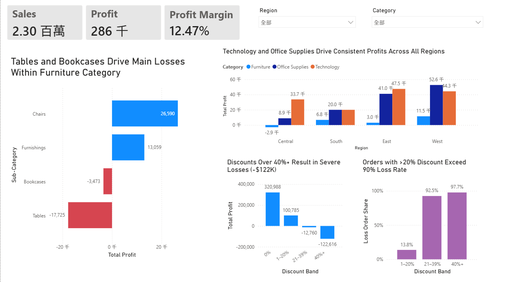

# Retail Sales Analysis

## 專案說明
使用 Python , SQL 與 Power BI 分析 Superstore 零售銷售資料，
探討各地區、品項的銷售額、利潤及折扣率之差異，並找出虧損來源與折扣風險。

## 使用技術
- Python (pandas, matplotlib)
- SQL (SQLite, SQLAlchemy)
- Power BI

## 分析內容
1. 資料概覽
2. 地區銷售分析
3. 品項銷售分析
4. 地區 + 品項交叉分析
5. 虧損分析
6. 折扣率與虧損分析
7. Power BI 商業視覺化診斷

## Power BI 儀表板

完整互動式檔案：`superstore.pbix`（需用 Power BI Desktop 開啟）

## 主要發現
- West 地區整體表現最強，South 地區銷售額最低，Central 地區利潤最低
- Furniture 品項銷售額位居第二，但利潤極低，虧損集中在 Tables 與 Bookcases
- 虧損訂單累積金額最大的三個子類別（Binders、Tables、Machines）與過高的折扣率明顯相關
- Tables 無折扣時僅小幅獲利，折扣達 20% 即轉為虧損，顯示其利潤空間薄、對折扣高度敏感
- 折扣超過 20% 後約 9 成訂單虧損，超過 40% 時累積虧損約 -122.6K

## 商業建議
- 針對 South 地區擴大銷售規模與資源投入（利潤率尚可，銷售額最低）
- 針對 Central 地區檢討 Furniture 的定價與折扣，改善高營收、低獲利的落差
- 針對 Tables 商品重新檢討定價，並避免給予折扣
- 將整體促銷折扣上限設在 20% 以內，並依品類進一步調整

## 分析限制
- 本分析未納入時間維度，無法判斷銷售淡旺季趨勢
- 缺乏競爭對手資料，無法進行競品比較分析

## 資料來源
Kaggle - Sample Superstore Dataset

---------------------------------------------------------------------------------------------------------

# Retail Sales Analysis

## Overview
Analyzed Superstore retail sales data using Python , SQL and Power BI to identify 
regional performance gaps, category-level profitability issues, and the 
relationship between discount rates and losses.

## Tools & Technologies
- Python (pandas, matplotlib)
- SQL (SQLite, SQLAlchemy)
- Power BI

## Analysis Scope
1. Data overview
2. Regional sales analysis
3. Category-level sales analysis
4. Region × Category cross-analysis
5. Loss-making transaction analysis
6. Discount rate vs. profit losses analysis
7. Power BI Business Diagnostics

## Key Findings
- West is the strongest region overall; South has the lowest sales, and Central has the lowest profit
- Furniture ranks second in sales but has very low profit, with losses concentrated in Tables and Bookcases
- The three sub-categories with the largest cumulative losses from loss-making orders (Binders, Tables, Machines) are clearly linked to excessive discounting
- Tables earn only a small profit with no discount and turn unprofitable at a 20% discount, indicating thin margins and high sensitivity to discounts
- Above a 20% discount, about 90% of orders are loss-making; above 40%, cumulative losses reach about -$122.6K
  
## Recommendations
- South: expand sales volume and resource investment (profit margin is healthy, but sales are the lowest)
- Central: review Furniture pricing and discounts to close the gap between high revenue and low profit
- Tables: reassess pricing and avoid offering discounts
- Cap overall promotional discounts at 20%, and refine the limit further by category

## Limitations
- The analysis does not include a time dimension, so seasonality cannot be assessed
- No competitor data is available, so competitive benchmarking is not possible

## Data Source
Kaggle — Sample Superstore Dataset
